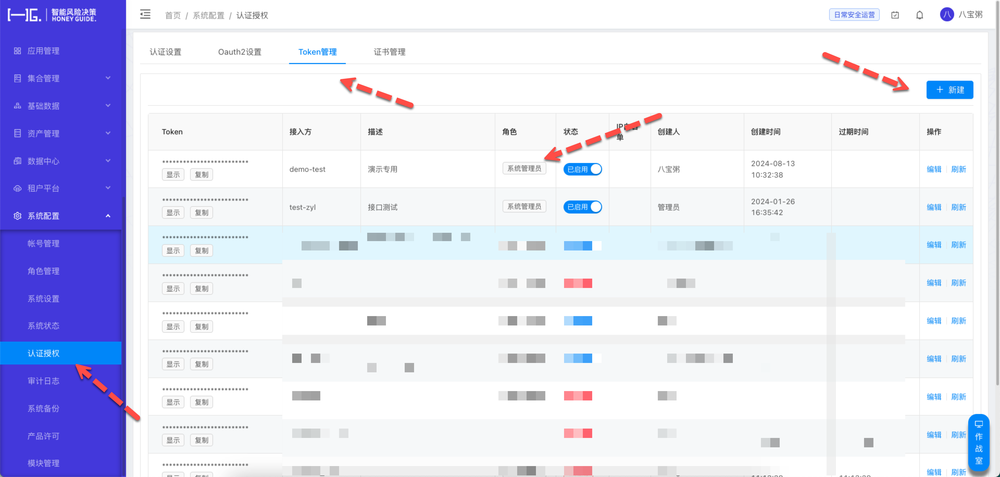
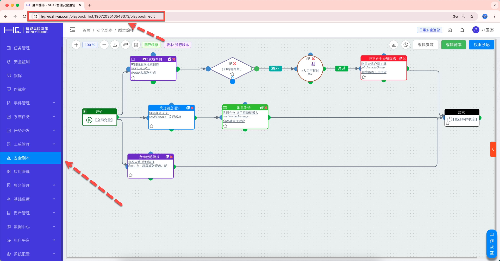
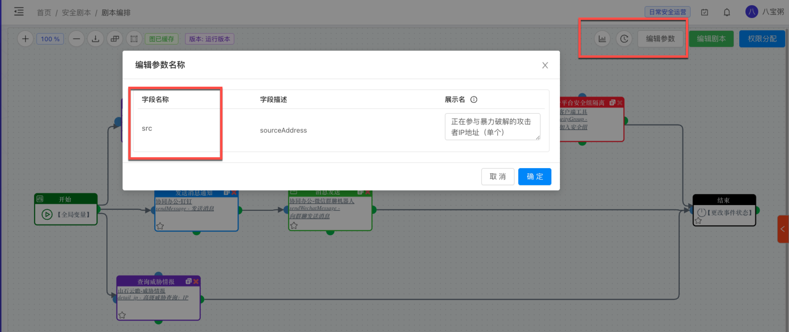
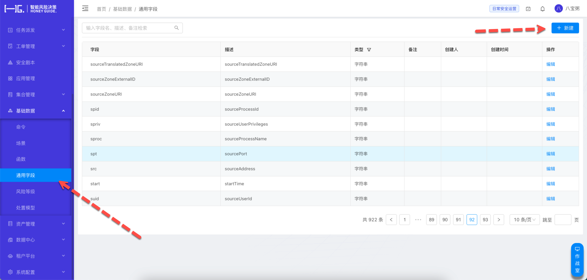

# Playbook配置信息样例

以下配置信息，将作为提示词的一部分发送给大模型，由大模型决定选择使用哪个剧本以及使用什么参数。

DeepSOC默认对接的SOAR产品是编排自动化产品Octomation，因此需要用户从Octomation中提取相关参数信息放到[提示词文件模板](../app/prompts/background_soar_playbooks.md)中。

```yaml
### SOAR 安全剧本能力清单
playbooks:
  - id: 12321435630187042
    name: query_asset_info_by_ip
    desc: 根据IP地址查询资产信息
    logic: 根据给定的IP地址，查询资产信息，包括：IP地址、资产类型、资产所属部门、资产所属业务线、资产所属负责人、资产所属负责人联系方式等。
    params:
      - name: dst
        desc: 待查询的IP地址
        required: true

  - id: 12302548181076017
    name: freeze_windows_ad_user
    desc: 冻结Windows AD用户
    logic: 根据给定的用户名，冻结Windows AD用户
    params:
      - name: user_name
        desc: 待冻结的Windows AD用户名
        required: true
      - name: freeze_duration_minute
        desc: 冻结时长(分钟)
        default: 60
        required: false

```

# OctoMation 剧本相关信息

用户需要提前准备好可用的OctoMation编排自动化产品的运行环境，并以admin权限登录后台，配置参数。

假设用户OctoMation系统访问地址：https://192.168.0.11

## 创建API Token

登录后台，通过菜单，进入设置页面，点击`认证授权`菜单后，通过`Token管理`创建API Token



创建Token后，点击`复制`，可获得API Token。

注意：创建Token时，勾选的角色务必拥有剧本执行权限。

## 如何获取剧本ID

通过OctoMation后台菜单`安全剧本`，可以遍历查看所有可用的安全剧本。点击剧本可以查看详情。在浏览器地址栏上可以看到剧本的ID号。



剧本详情页地址类似：`https://192.168.0.11/playbook_list/1907203516548373/playbook_edit`，此处的`1907203516548373`就是剧本ID。

## 如何获取剧本参数

在剧本编排界面，点击右上角的`编辑参数`按钮，可以查看剧本参数。



## 创建通用参数名称

如果你在编辑剧本过程中，默认CEF字段无法满足要求，有定制化的需求，可以通过【基础数据】|【通用字段】创建适合当前环境的通用参数。



## 获取剧本描述信息

在剧本画布右侧，点击三角形按钮，弹出抽屉菜单，可查看当前剧本的描述信息。


# 更标准的剧本信息获取方法

通过OctoMation API可以一次获取多个剧本的详情信息，而无需手工操作。

参考[https://github.com/flagify-com/OctoMation/wiki/Octomation开放接口#33-获取单个剧本执行所需要的参数](https://github.com/flagify-com/OctoMation/wiki/Octomation%E5%BC%80%E6%94%BE%E6%8E%A5%E5%8F%A3#33-%E8%8E%B7%E5%8F%96%E5%8D%95%E4%B8%AA%E5%89%A7%E6%9C%AC%E6%89%A7%E8%A1%8C%E6%89%80%E9%9C%80%E8%A6%81%E7%9A%84%E5%8F%82%E6%95%B0)


更多SOAR剧本相关的操作，请参考[编排自动化产品社区免费版OctoMation官方Wiki](https://github.com/flagify-com/OctoMation/wiki)

> updated:2025-03-25